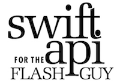
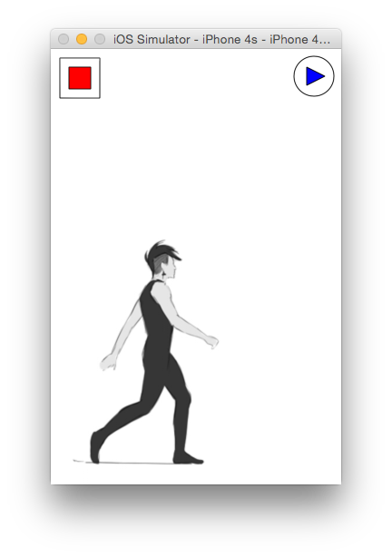

# ActionSwift 3.0
*ActionScript 3 SDK in Swift*


Swift is awesome - but do you ever reminisce about the old days of ActionScript 3.0? The old days of DisplayObjects, Sprites, MovieClips, EventDispatchers - oh and who can forget gotoAndPlay? Well, now you can enjoy iOS native development using the power of Swift syntax but with the AS3 SDK! Whaa? How is this possible? Is this heresy?

**ActionSwift3**

Underneath the hood ActionSwift3 is based on the SpriteKit Framework but ActionSwift 3 SDK is based on familiar AS3 SDK classes:

*   DisplayObject
*   InteractiveObject
*   DisplayObjectContainer
*   Sprite
*   Graphics
*   Stage
*   MovieClip
*   SimpleButton
*   TextField
*   TextFormat
*   Sound
*   SoundChannel
*   EventDispatcher
*   Event
*   EventHandler
*   Touch
*   TouchEvent (in a touch environment TouchEvent makes more sense to use than MouseEvent)

Easing classes are also included for convenience from [here](https://github.com/craiggrummitt/SpriteKitEasingSwift).

API documentation can be found at [cocoadocs](http://cocoadocs.org/docsets/ActionSwift3/)

You can find a tutorial - **Swift API for the Flash Guy** - [here](https://craiggrummitt.wordpress.com/2015/08/11/swift-api-for-the-flash-guy/).




## Installation

ActionSwift is available through [CocoaPods](https://cocoapods.org/pods/ActionSwift3). To install
it, add the following to your Podfile: (Static Swift frameworks require iOS 8)

```ruby
use_frameworks!
platform :ios, '8.0'
pod 'ActionSwift3'
```

Don't forget to import the Pod where you would like to use it:

```Swift
import ActionSwift3
```

Alternatively, if you would like access to the example project as well, clone the github project [here](https://github.com/craiggrummitt/ActionSwift3).

**ActionSwift**

ActionSwift is a sample project that you can use to play with ActionSwift3. Start with taking a look at GameViewController.swift. GameViewController does the following:

1. Sets up the stage.
2. Creates a 'play' sprite that draws a circle containing a triangle.
3. Creates a 'stop' sprite that draws a rectangle containing a rectangle.
4. Creates a movieclip that displays textures defined by an array of strings referring to the images in the folder 'images.atlas'. 
5. Shows how to create an event listener by setting up clicks on all three sprites. The stop and play sprites 'stop' and 'play' the movieclip. Touching the movieclip activates a drag-drop operation.



**How to use ActionSwift3**

Here is some sample code to get your head around how to use ActionSwift3.

***Stage***

To begin with, you need to set up the Stage in a ViewController that contains a SKView(this is done for you automatically if you set up a Game-SpriteKit project)

```Swift
let stage = Stage(self.view as! SKView)
```

***Sprite***

You can now call familiar methods on the stage. For example, you could instantiate a sprite, and draw a rectangle on its graphics property, and then add this sprite to the stage:

```Swift
let sprite = Sprite()
sprite.graphics.beginFill(UIColor.redColor())
sprite.graphics.drawRect(10,10,100,44)
sprite.name = "shapes"
stage.addChild(sprite)
```

***MovieClip***

To create a movieclip, you will need images within a folder with the extension 'atlas' in your project (eg.'images.atlas'). This will automatically generate a Texture Atlas. Set up an array of these image file names, and pass them in when you instantiate a MovieClip. These will now be the 'frames' of your movieclip, which you will be able to call familiar methods - gotoAndPlay(), gotoAndStop(), stop() and play(). Use Stage.size to get the dimensions of the device. Oh and x=0, y=0 is the top left of the stage. Hooray!

```Swift
let walkingTextures = ["walking1","walking2","walking3"]
let movieClip = MovieClip(textureNames: walkingTextures)
movieClip.x = 0
movieClip.y = Stage.size.height - movieClip.height
stage.addChild(movieClip)
```

**SimpleButton**

You can create a SimpleButton object, with an up and down state(not much point of over states on touch screens!) You can use sprites(with shapes on the graphics object) or movieclips(with textures) as the states.

```Swift
let play = SimpleButton(upState: playUpState, downState: playDownState)
stage.addChild(sprite)
```

***TextField***

Use familiar syntax to create a textfield. Build the basics of the textfield using the TextField class, and then apply text formatting to the defaultTextFormat property, using the TextFormat class.

```Swift
let text = TextField()
text.width = 200
text.text = "Salutations to you, world"

let textFormat = TextFormat(font: "ArialMT", size: 20, leading: 20, color: UIColor.blackColor(), align:.Center)
text.defaultTextFormat = textFormat

stage.addChild(text)
```

***Sound***

Use sound to play sounds included in your project - a big difference though - now wav files are supported as well as mp3. *Hooray!* Loop the audio, or play it from a point in the file. As per the strange AS3 API, use SoundChannel to stop the sound.

```Swift
sound = Sound(name: "ButtonTap.wav")
sound.play()
```

***EventDispatcher***

Just as you would expect, Sprites, SimpleButtons and MovieClips will dispatch events. As Swift is not able to check equality between two functions, an additional class called 'EventHandler' stores the EventHandler, along with a string representing the EventHandler, that can be checked for equality. For example, here's how to set up an enterFrame event handler:

```Swift
movieClip.addEventListener(EventType.EnterFrame.rawValue, EventHandler(enterFrame, "enterFrame"))
func enterFrame(event:Event) -> Void {
    trace("This is called every frame")
}
```

***trace***

Oh yeah - and trace is back!

```Swift
trace("This is the most amazing thing I've ever seen, trace is back! How did they do this?")
```

**Enhancements**

ActionSwift3 is a work in progress, feel free to contribute! 

Ideas for enhancements:

*   Date
*   XML
*   Add more complex shapes on Graphics

**Updates**

1.1
*   Added int and Boolean data types

1.2
*   Added TextField
*   Resolved issue with stage updates not propogating
*   Added license

1.3
*   Added SimpleButton
*   Added UIColor extension for hexidecimal support

1.4
*   Added Sound, SoundChannel

1.5
*	Updated for Swift 2

1.6
*   Resolved issue with labels not registering taps
*   Resolved issue with rotation

***Credits***

*   "Walking animation" by [Kyoux](http://kyoux.deviantart.com/)
*   "ActionScript" by Adobe Systems Inc.
*   "Swift" by Apple Inc.
*   "Swift logo" by Apple Inc.